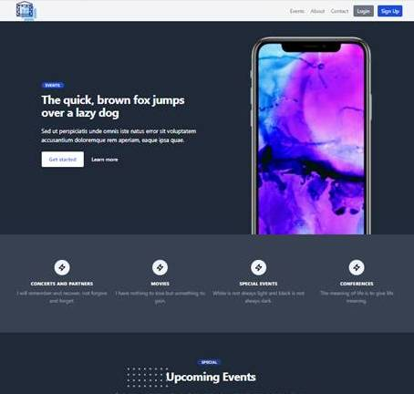

# EVENTGUARD APPLICATION

### **Topic of the project:** `Eventguard` helps people create their accounts and share events with the public, like concerts, movies, conferences, webinars, presentations, etc. It provides dashboard to register users where they can edit their account, create, edit and delete their events.




### **Ruby version:** 3.0.2 ([check here](https://github.com/kennedytechnology/off-to-space/blob/master/.ruby-version))
### **Rails version:** 6.1.4 ([check here](https://github.com/kennedytechnology/off-to-space/blob/master/Gemfile))

### **System dependencies:** for this project, we need Ruby and Rails
- Ruby Installation: [Click here](https://www.ruby-lang.org/en/documentation/installation/)
- Rails Installation: [Click here](https://guides.rubyonrails.org/v5.0/getting_started.html)

### **Prerequisites:**
- Git
- Node
- Yarn
- Postgresql
- Terminal

### **Technologies used:**
- Ruby
- Rails
- TailwindCSS
-
### **How to launch `Eventguard`?**
- Clone the [repository](https://github.com/kennedytechnology/eventguard)
- Make sure you have the suitable version for the project (as stated above)
    - Note: If you do not have the suitable versions installed, refer to the links above to find the steps for installation of Ruby and Rails
- Go to the correct directory
- Run the following commands:

```
bundle
yarn install
rails db:create && rails db:migrate && rails db:seed
rails server
```
- Open your browser and go to http://localhost:3000/
